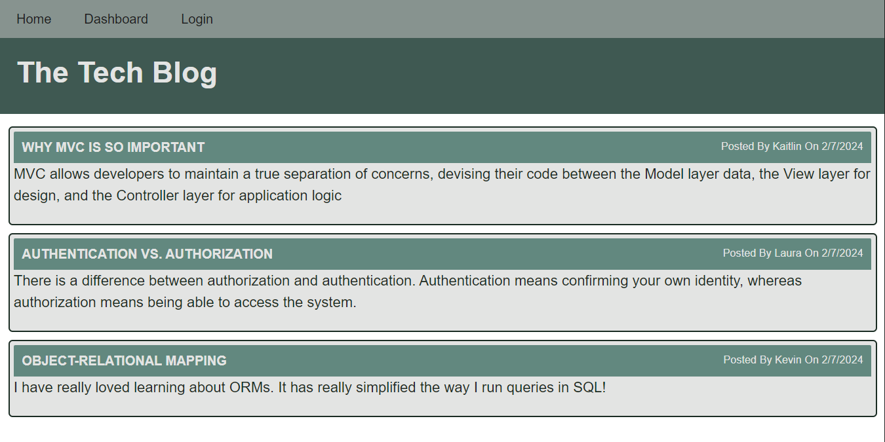

# Tech Blog

## Description
CMS-style blog site where developers can publish their blog posts and comment on other developers’ posts.

[Web Site](https://tech-blog-kevin-52708dd36d86.herokuapp.com/)

## Table of Contents

- [Installation](#installation)
- [Usage](#usage)
- [Credits](#credits)
- [License](#license)
- [How to Contribute](#guidelines)
- [Tests](#tests)
- [Questions](#questions)

## Installation

N/A

## Usage

After signing up and/or logging in, you can:
* Add new blog posts
* Edit existing posts
* View and comment on posts from other bloggers

## Credits

* Node.js Copyright [OpenJS Foundation](https://openjsf.org/) and Node.js contributors. All rights reserved. 
* MySQL is © 2024 Oracle
* Express.js Copyright © 2017 StrongLoop, IBM, and other expressjs.com contributors.
* Sequelize Copyright © 2024 Sequelize Contributors
* Dotenv Copyright (c) 2015, Scott Motte. All rights reserved.
* Handlebars.js Copyright (C) 2011-2019 by Yehuda Katz

## License

This application is covered under the MIT License.

## How To Contribute

N/A

## Tests

N/A

## Questions

[GitHub Profile](https://github.com/kevinchogan)

For questions, please contact kchogan@pacbell.net.
